<div align="center">

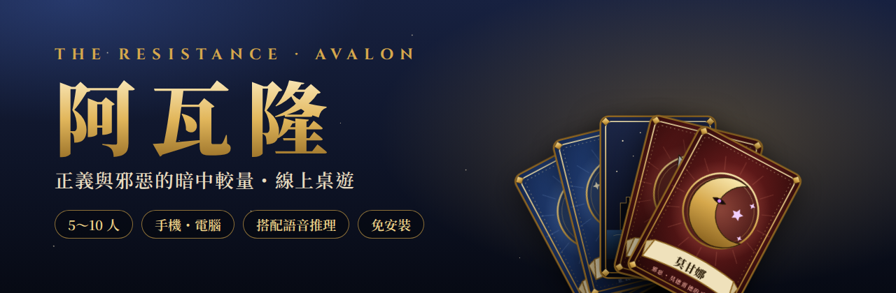

# 阿瓦隆・線上桌遊

**正義與邪惡的暗中較量 —— 5～10 位朋友各自用手機或電腦，一起玩《The Resistance: Avalon》。**

[](https://github.com/Sid-EN/Avalon/actions/workflows/ci.yml)
[](https://sid-en.github.io/Avalon/)


### [🎮 立即遊玩](https://sid-en.github.io/Avalon/)

[遊戲介紹](#intro) ・ [畫面預覽](#preview) ・ [角色](#roles) ・ [遊戲規則](#rules) ・ [線上怎麼玩](#play) ・ [新手訣竅](#tips) ・ [技術架構](#tech)

</div>

---

<a name="intro"></a>

## 🏰 這是什麼遊戲？

> 亞瑟王的圓桌騎士正為了不列顛的未來出征，<br>
> 然而騎士之中，潛伏著**莫德雷德的爪牙**……
>
> 只有**梅林**看穿了邪惡，但他只能用暗示指引眾人——<br>
> 一旦身分曝光，刺客的匕首便會落下。

《阿瓦隆》是一款**隱藏身分的推理桌遊**。每位玩家秘密拿到一張身分牌，分成人數較多的**正義方**與互相認識的**邪惡方**。
大家一起組隊出任務、投票、互相懷疑與說服；沒有淘汰、沒有骰子，勝負全靠**觀察、推理與話術**。

這個專案把整套桌遊搬到網頁上：**不用安裝、不用註冊**，房主開房後把代碼丟到 Discord／LINE，朋友用手機或電腦點開就能一起玩。

<table>
  <tr>
    <td align="center" width="25%">🧑‍🤝‍🧑<br><b>5～10 人</b><br><sub>朋友聚會剛剛好</sub></td>
    <td align="center" width="25%">⏱️<br><b>約 30 分鐘</b><br><sub>一局接一局停不下來</sub></td>
    <td align="center" width="25%">📱<br><b>手機・電腦</b><br><sub>各自連線，身分只有自己看得到</sub></td>
    <td align="center" width="25%">🎙️<br><b>搭配語音</b><br><sub>Discord／LINE 一邊討論一邊玩</sub></td>
  </tr>
</table>

---

<a name="preview"></a>

## 📸 畫面預覽

<table>
  <tr>
    <td width="68%" align="center">
      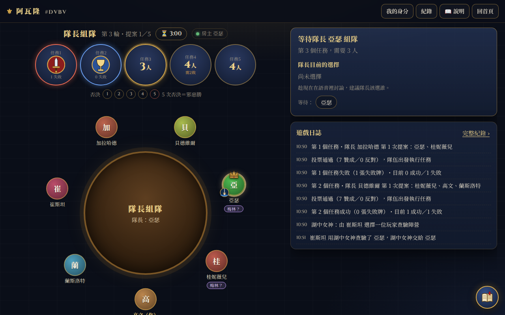<br>
      <sub><b>圓桌遊戲畫面</b>・任務進度、否決次數、隊長與隊員一目了然</sub>
    </td>
    <td width="32%" align="center">
      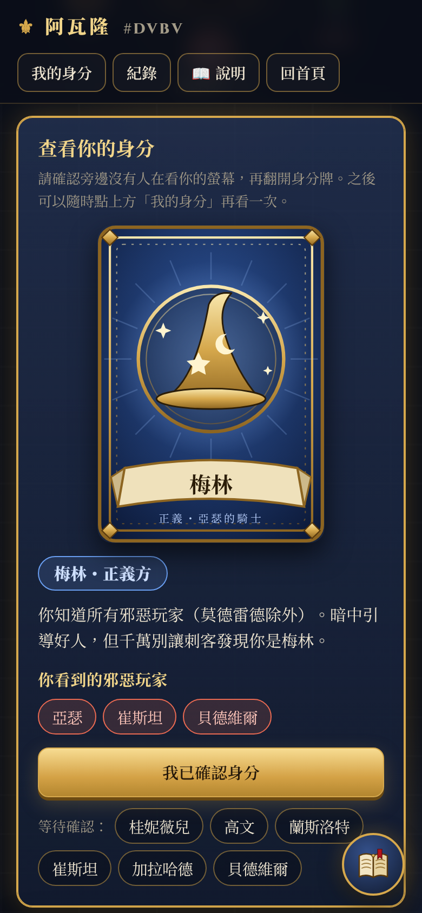<br>
      <sub><b>翻開身分牌</b>・角色情報只有自己看得到</sub>
    </td>
  </tr>
  <tr>
    <td align="center">
      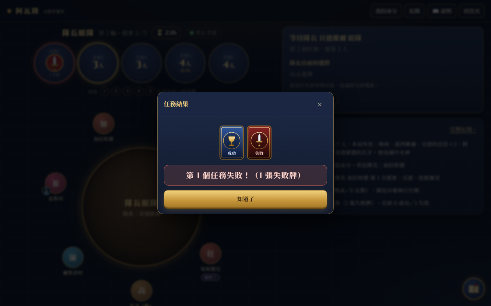<br>
      <sub><b>任務結果</b>・打亂後翻牌，只公開失敗牌張數</sub>
    </td>
    <td align="center">
      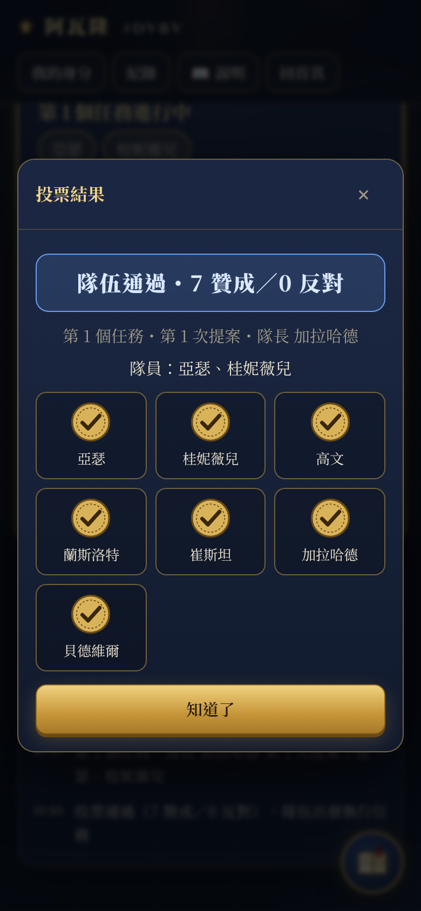<br>
      <sub><b>投票結果</b>・全員投完才同時公開</sub>
    </td>
  </tr>
</table>

<details>
<summary><b>👉 更多畫面：首頁、大廳、組隊、湖中女神、結算、遊戲紀錄、新手教學</b></summary>
<br>

| 首頁 | 大廳（房主設定） |
|:---:|:---:|
| 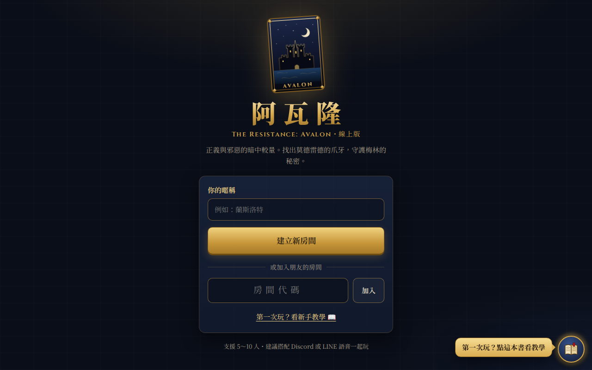 | 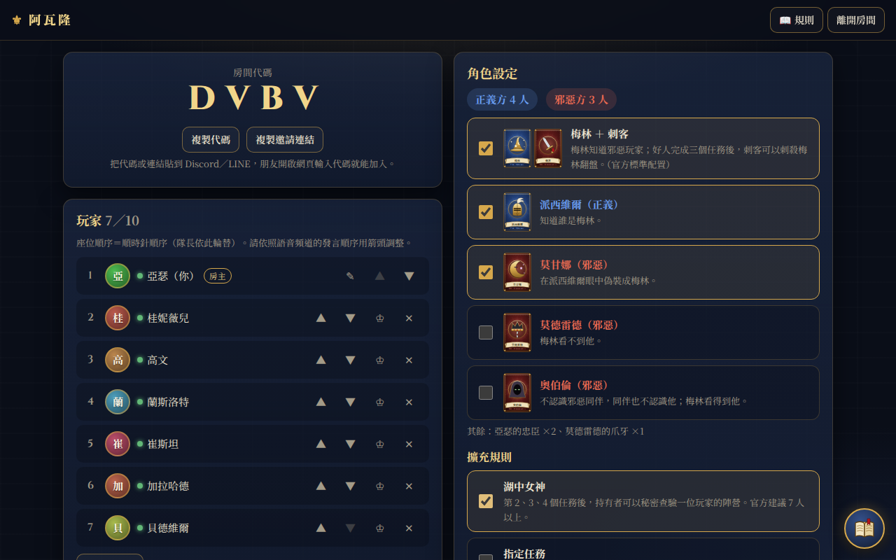 |
| **隊長組隊** | **湖中女神** |
| 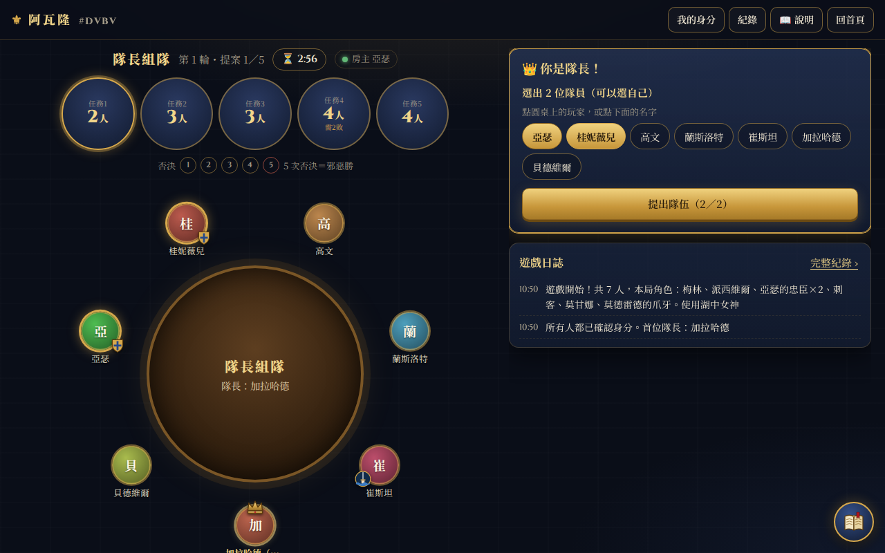 | 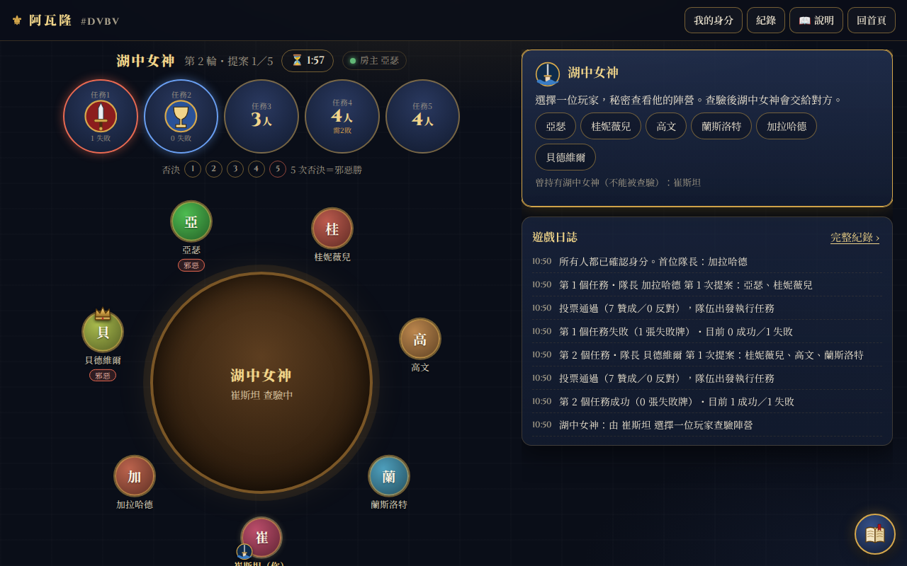 |
| **遊戲結算（公開所有身分）** | **完整遊戲紀錄** |
| 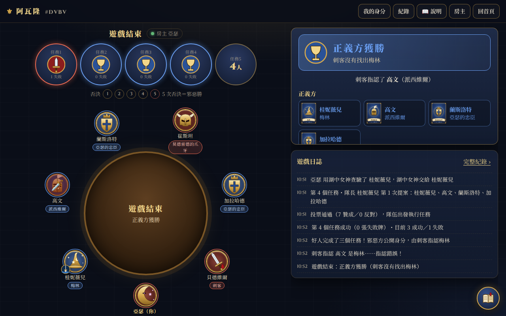 | 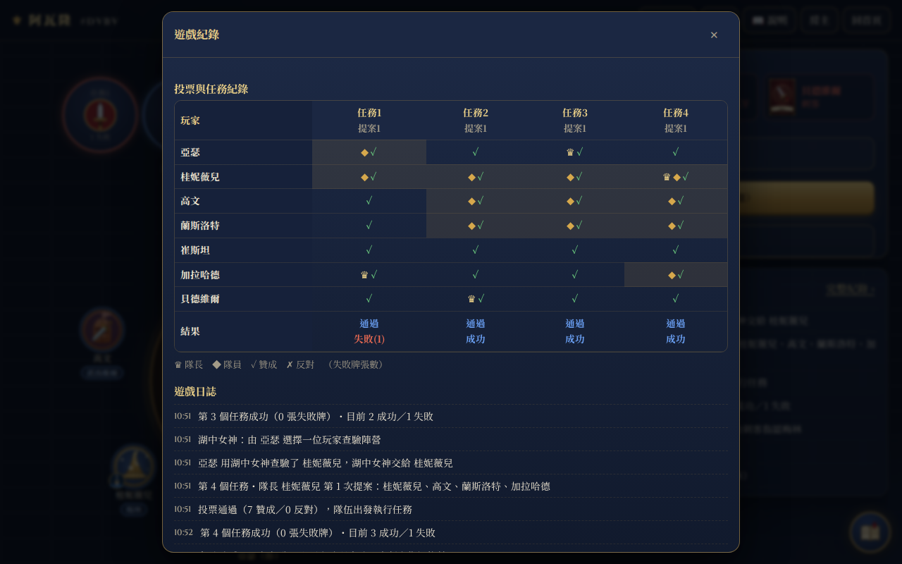 |

<p align="center">
  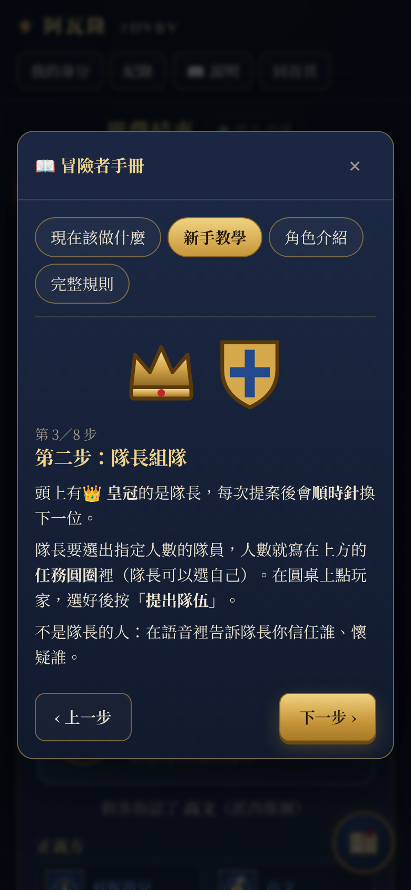<br>
  <sub><b>右下角的說明書</b>・隨時查看「現在該做什麼」與新手教學</sub>
</p>

</details>

---

## 🎯 遊戲目標

<table>
  <tr>
    <td width="50%" valign="top">
      <p align="center">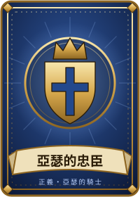</p>
      <h3 align="center">😇 正義方・亞瑟的騎士</h3>
      <ul>
        <li>人數較多，但<b>不知道誰是壞人</b></li>
        <li>完成 <b>3 個任務</b>就獲勝</li>
        <li>最後還要<b>保護梅林</b>不被刺客認出</li>
      </ul>
    </td>
    <td width="50%" valign="top">
      <p align="center">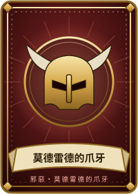</p>
      <h3 align="center">😈 邪惡方・莫德雷德的爪牙</h3>
      <ul>
        <li>人數較少，但<b>彼此互相認識</b></li>
        <li>讓 <b>3 個任務失敗</b>就獲勝</li>
        <li>或在最後<b>刺殺梅林</b>逆轉勝</li>
      </ul>
    </td>
  </tr>
</table>

---

<a name="roles"></a>

## 🎭 角色介紹

所有角色都依照**原版規則書**。房主可以在大廳自由勾選特殊角色，其餘位置自動補上「亞瑟的忠臣」與「莫德雷德的爪牙」，系統會依人數檢查配置是否合法。

| 卡牌 | 角色 | 陣營 | 能力 | 建議 |
|:---:|:---:|:---:|---|:---:|
| 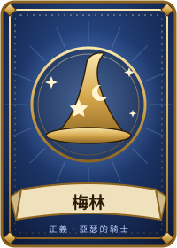 | **梅林** | 😇 正義 | 知道所有邪惡玩家（**莫德雷德除外**），但必須隱藏自己，否則會被刺客刺殺 | ⭐ 標準 |
| 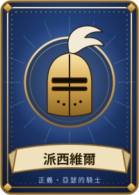 | **派西維爾** | 😇 正義 | 知道誰是梅林；若莫甘娜在場，會看到兩個人但分不出誰是誰 | 選用 |
|  | **亞瑟的忠臣** | 😇 正義 | 沒有特殊能力，靠推理找出壞人 | 基本 |
| 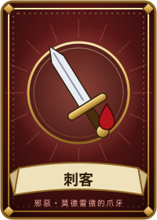 | **刺客** | 😈 邪惡 | 正義方完成 3 個任務後，指認一名玩家——猜中梅林邪惡方就逆轉獲勝 | ⭐ 標準 |
| 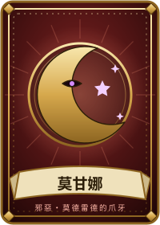 | **莫甘娜** | 😈 邪惡 | 在派西維爾眼中看起來和梅林一模一樣 | 選用 |
| 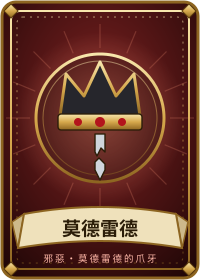 | **莫德雷德** | 😈 邪惡 | 邪惡首領，**梅林看不到他** | 選用 |
| 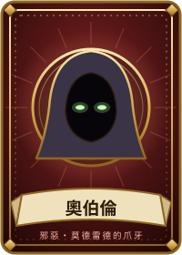 | **奧伯倫** | 😈 邪惡 | 不認識邪惡同伴，同伴也不認識他（梅林看得到他） | 選用 |
|  | **莫德雷德的爪牙** | 😈 邪惡 | 沒有特殊能力，和邪惡同伴互相認識 | 基本 |

### 🌙 夜晚：誰看得到誰？

遊戲開始時每個人翻開身分牌，依角色得到不同的情報：

| 角色 | 👁️ 看得到 | 🙈 看不到 |
|---|---|---|
| **梅林** | 所有邪惡玩家（包含奧伯倫） | 莫德雷德 |
| **派西維爾** | 梅林與莫甘娜（分不出誰是誰） | — |
| **刺客・莫甘娜・莫德雷德・爪牙** | 彼此 | 奧伯倫 |
| **奧伯倫** | 沒有人 | 所有邪惡同伴 |
| **亞瑟的忠臣** | 沒有人 | — |

> 💡 第一次玩建議只用 **梅林 ＋ 刺客**，熟悉後再加入 **派西維爾 ＋ 莫甘娜**，老手可以挑戰 **莫德雷德** 與 **奧伯倫**。

---

<a name="rules"></a>

## 📜 遊戲規則

### 🔄 遊戲流程

<p align="center">
<picture>
  <source media="(prefers-color-scheme: dark)" srcset="docs/images/diagram-game-flow-dark.png">
  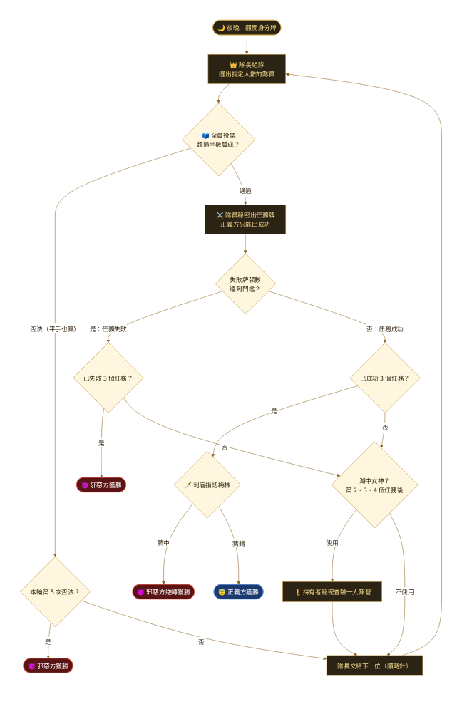
</picture>
<br><sub>圖表原始檔：<a href="docs/diagrams/game-flow.mmd">docs/diagrams/game-flow.mmd</a></sub>
</p>

### 📋 每一輪怎麼進行

| | 階段 | 怎麼做 |
|:---:|:---:|---|
|  | **① 組隊** | 頭上有皇冠的是**隊長**。隊長依照這個任務需要的人數選出隊員（可以選自己），大家可以在語音裡給建議。 |
|   | **② 投票** | 所有人同時投**贊成**或**反對**，**超過半數贊成**才通過（平手算否決）。每個人的票會在全員投完後公開。被否決就換下一位隊長，**同一輪連續 5 次否決，邪惡方直接獲勝**。 |
|   | **③ 任務** | 只有隊員秘密出牌。**正義方只能出成功**，邪惡方可以選成功或失敗。牌會打亂後公開，只看得到**失敗牌張數**，不知道是誰出的。 |

### 👥 人數配置與出隊人數

| 人數 | 5 | 6 | 7 | 8 | 9 | 10 |
|---|:---:|:---:|:---:|:---:|:---:|:---:|
| 😇 **正義方** | 3 | 4 | 4 | 5 | 6 | 6 |
| 😈 **邪惡方** | 2 | 2 | 3 | 3 | 3 | 4 |
| 任務 1 | 2 | 2 | 2 | 3 | 3 | 3 |
| 任務 2 | 3 | 3 | 3 | 4 | 4 | 4 |
| 任務 3 | 2 | 4 | 3 | 4 | 4 | 4 |
| 任務 4 | 3 | 3 | **4★** | **5★** | **5★** | **5★** |
| 任務 5 | 3 | 4 | 4 | 5 | 5 | 5 |

<sub>★ 7 人以上的第 4 個任務需要 **2 張失敗牌**才會失敗；其他任務只要 1 張失敗牌就失敗。</sub>

### 🏆 勝負條件

| 😇 正義方獲勝 | 😈 邪惡方獲勝 |
|---|---|
| 完成 3 個任務，**而且**刺客沒有認出梅林 | 3 個任務失敗 |
| | 同一輪連續 5 次否決隊伍 |
| | 正義方完成 3 個任務後，刺客**猜中梅林** |

### 🧩 擴充規則（原版規則書的選用規則，房主可開關）

<table>
  <tr>
    <td width="90" align="center"></td>
    <td>
      <b>湖中女神</b><br>
      一開始交給首位隊長右手邊的玩家。第 2、3、4 個任務結束後，持有者可以<b>秘密查看一位玩家的陣營</b>（只有自己看得到，公布時可以說謊），然後把湖中女神交給被查驗的人。曾經持有過的人不能被查驗。官方建議 7 人以上使用。
    </td>
  </tr>
  <tr>
    <td width="90" align="center">🗺️</td>
    <td>
      <b>指定任務</b><br>
      隊長組隊時可以<b>選擇要挑戰哪一個任務</b>，出隊人數依該任務而定。第 5 個任務必須先成功 2 個任務才能挑戰。
    </td>
  </tr>
</table>

---

<a name="play"></a>

## 🕹️ 線上版怎麼玩

### 🙋 一般玩家

1. 開啟 **[sid-en.github.io/Avalon](https://sid-en.github.io/Avalon/)**，輸入暱稱
2. 輸入房主給的 **4 碼房間代碼**（直接貼上邀請連結也可以）→ 加入
3. 進入 Discord／LINE 語音，等房主開始
4. 遊戲開始時**翻開身分牌**，確認後按「我已確認身分」
5. 輪到你時行動面板會發光並提示「**輪到你了！**」，照著畫面操作即可

### 👑 房主

1. 首頁按「**建立新房間**」，把房間代碼或邀請連結傳給朋友
2. 用 ▲▼ 依照語音頻道的順序**排好座位**（順時針，隊長依此輪替）
3. 勾選要使用的**角色與擴充規則**，需要的話設定倒數提醒時間
4. 按「**開始遊戲**」，系統會自動洗牌、發身分

> 🎲 **房主的瀏覽器擔任裁判**，負責計票、判定任務與推進流程，所以房主請保持網頁開啟。

### 🆘 遇到狀況怎麼辦？

| 狀況 | 會發生什麼 |
|---|---|
| 🔄 重新整理、手機切到背景 | 用同一台裝置打開網頁，**自動回到原本的座位** |
| 🏠 想暫時離開 | 按上方「**回首頁**」，座位會保留，輸入房間代碼就能回來 |
| 📴 房主斷線 | 離線超過 30 秒，**自動交給下一位在線玩家**擔任房主 |
| ⏳ 有人離線，遊戲卡住 | 房主打開「**房主**」選單 →「卡關處理」（例如把離線玩家的票算反對、換下一位隊長），會記錄在日誌 |
| ⏰ 倒數時間到 | **只會提醒**，不會自動替任何人做決定 |
| 🔒 不想讓其他人加入 | 人到齊後，房主在大廳勾選「**鎖定房間**」 |
| 📖 不知道現在要做什麼 | 點右下角的**書本**，看「現在該做什麼」 |

---

<a name="tips"></a>

## 💡 新手小訣竅

<details>
<summary><b>😇 正義方</b></summary>
<br>

- **看投票紀錄**：誰贊成了後來失敗的隊伍？誰總是反對乾淨的隊伍？
- **梅林**：不要每次都精準反對壞人的隊伍，太準會被刺客抓到；用暗示引導，偶爾也要讓步。
- **派西維爾**：你看到的兩個人之中可能有莫甘娜，觀察他們的發言；必要時可以假裝自己是梅林替他擋刀。
- **第 5 次提案**要特別小心，再被否決邪惡方就直接獲勝。

</details>

<details>
<summary><b>😈 邪惡方</b></summary>
<br>

- **混進隊伍**：想辦法讓自己或同伴被選上，在關鍵時刻出失敗牌。
- **別太早暴露**：每次都出失敗牌、每次都投贊成有同伴的隊伍，很快就會被看穿。
- **刺客**：整局都要觀察誰像梅林——誰總是「剛好」知道哪支隊伍有問題？
- **莫甘娜**：假裝自己是梅林，讓派西維爾搞混。

</details>

---

## ✨ 線上版特色

<table>
  <tr>
    <td width="33%" valign="top"><b>📚 完整原版規則</b><br><sub>8 種角色、湖中女神、指定任務，依人數自動配置與檢查</sub></td>
    <td width="33%" valign="top"><b>🔒 防偷看設計</b><br><sub>身分、選票、任務牌由資料庫安全規則保護，開發者工具也看不到</sub></td>
    <td width="33%" valign="top"><b>🔄 斷線重連</b><br><sub>重新整理自動回座位，房主離線自動交接</sub></td>
  </tr>
  <tr>
    <td valign="top"><b>📖 新手說明書</b><br><sub>8 步圖文教學，依你的身分與階段提示下一步</sub></td>
    <td valign="top"><b>🗒️ 完整遊戲紀錄</b><br><sub>每次提案的隊長、隊員、每個人的票與任務結果</sub></td>
    <td valign="top"><b>⏳ 倒數提醒</b><br><sub>各階段可設定時間，時間到只提醒不代打</sub></td>
  </tr>
  <tr>
    <td valign="top"><b>🎨 原創插圖</b><br><sub>中世紀亞瑟王風格 SVG 角色卡，手機電腦都清晰</sub></td>
    <td valign="top"><b>🆓 完全免費</b><br><sub>GitHub Pages ＋ Firebase 免費方案，不用信用卡</sub></td>
    <td valign="top"><b>✅ 自動化測試</b><br><sub>單元、功能、安全規則、多瀏覽器系統測試，通過才部署</sub></td>
  </tr>
</table>

### 🔒 公平性說明

- 每位玩家**只讀得到自己的身分**；其他人的身分、投票內容（公開前）、任務牌都讀不到。
- **正義方無法出失敗牌**、不能替別人投票、每人只能投一次——這些都在資料庫端強制檢查，不只是畫面限制。
- 不在房間裡的人看不到房間內容；被移出的玩家無法再加入。
- 遊戲進行中**不能改暱稱**，避免改成別人的名字冒充。
- 人到齊後房主可以**鎖定房間**，陌生人或被移出的人換個瀏覽器也進不來。
- ⚠️ 已知限制：沒有付費伺服器，身分由**房主的瀏覽器**分配，懂技術的房主理論上看得到全部身分。朋友局可以輪流當房主。

---

<a name="tech"></a>

## 🛠️ 技術架構

<p align="center">
<picture>
  <source media="(prefers-color-scheme: dark)" srcset="docs/images/diagram-architecture-dark.png">
  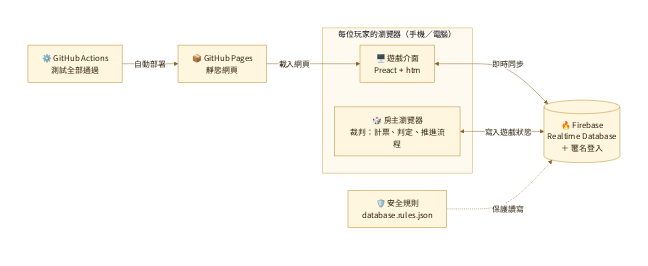
</picture>
<br><sub>圖表原始檔：<a href="docs/diagrams/architecture.mmd">docs/diagrams/architecture.mmd</a></sub>
</p>

| 項目 | 使用技術 |
|---|---|
| 前端 | 原生 ES Modules ＋ [Preact](https://preactjs.com/) ＋ [htm](https://github.com/developit/htm)（不需要建置流程） |
| 即時同步 | [Firebase Realtime Database](https://firebase.google.com/docs/database) ＋ 匿名登入（免費 Spark 方案） |
| 防作弊 | Firebase 安全規則（由 `tools/build-rules.mjs` 產生） |
| 部署 | GitHub Pages（由 GitHub Actions 在測試通過後部署） |
| 測試 | Node.js 內建測試、Firebase 模擬器、[Playwright](https://playwright.dev/) |

<details>
<summary><b>📁 專案結構</b></summary>

```
index.html              網頁入口
css/style.css           樣式
js/app.js               首頁與房間畫面切換
js/ui/lobby.js          大廳（玩家、座位、角色設定）
js/ui/board.js          遊戲畫面（圓桌、任務、投票、出牌、房主選單）
js/ui/panels.js         身分、結果、紀錄、規則等面板
js/ui/guide.js          右下角書本說明書
js/ui/common.js         共用元件
js/rules.js             官方規則資料（人數、出隊人數、角色）
js/game.js              規則邏輯（分配身分、計票、判定勝負）
js/state.js             房間狀態的純函式（座位、上線狀態、房主接手、暱稱）
js/host.js              房主瀏覽器擔任裁判，推進遊戲流程與卡關處理
js/room.js              建立／加入房間、上線狀態、玩家操作（Firebase）
js/art.js               自製 SVG 插圖
js/firebase.js          Firebase 連線
js/firebase-config.js   Firebase 專案設定
database.rules.json     Firebase 安全規則
tools/                  安全規則產生器、本機伺服器、語法檢查、網站輸出、README 圖片產生
tests/unit/             單元測試
tests/functional/       功能測試（房主裁判完整流程）
tests/rules/            安全規則測試（Firebase 模擬器）
tests/e2e/              系統測試（多個瀏覽器真的點網頁玩）
docs/                   架設教學、測試說明、README 圖片
.github/workflows/      CI/CD
```

</details>

---

## 🚀 自己架一個

整個架設免費、不需要信用卡，大約 15 分鐘，詳細圖文步驟請看 **[docs/SETUP.md](docs/SETUP.md)**：

1. 建立 Firebase 專案，開啟**匿名登入**與 **Realtime Database**
2. 把 `database.rules.json` 貼到 Firebase 的規則頁面
3. 把 Firebase 設定填入 `js/firebase-config.js`
4. 上傳到 GitHub，Pages 來源選「**GitHub Actions**」

## 🧪 開發與測試

每次 push 都會由 GitHub Actions 自動執行下列測試，**全部通過才會部署**。詳細說明請看 **[docs/TESTING.md](docs/TESTING.md)**。

| 測試 | 內容 | 數量 |
|---|---|:---:|
| 單元測試 | 官方規則表、遊戲邏輯、房間狀態、插圖、安全規則產生器 | 35 |
| 功能測試 | 房主裁判完整流程、卡關處理、房主交接 | 25 |
| 安全規則測試 | 在 Firebase 模擬器上逐條驗證讀寫權限 | 45 |
| 系統測試 | 多個手機／電腦瀏覽器完整對局、斷線重連、說明書 | 26 |

```bash
npm install                 # 安裝測試工具
npm test                    # 語法檢查＋單元測試＋功能測試（約 10 秒）
npm run test:emulator       # 安全規則測試＋系統測試（需要 Java）
npm run readme:assets       # 重新產生 README 的截圖與角色卡圖片
```

---

## 📄 版權聲明

- 本專案是**非官方的粉絲自製作品**，僅供朋友間免費遊玩，與原出版社無關。
- 桌遊《The Resistance: Avalon》由 **Don Eskridge** 設計、**Indie Boards & Cards** 出版，遊戲名稱與規則的權利屬於原作者與出版社。
- 本專案的所有插圖皆為**原創 SVG**，未使用官方卡圖。喜歡這款遊戲的話，請支持購買實體桌遊！

<div align="center">
<br>

<br>
<sub>願亞瑟王的榮光與你同在 ⚔️</sub>
</div>
